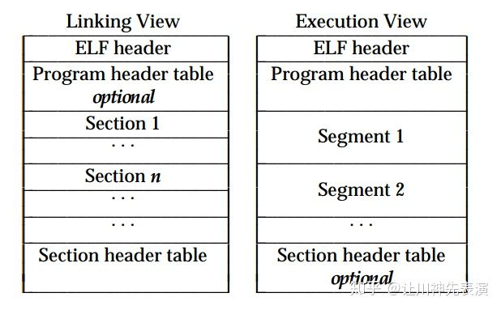
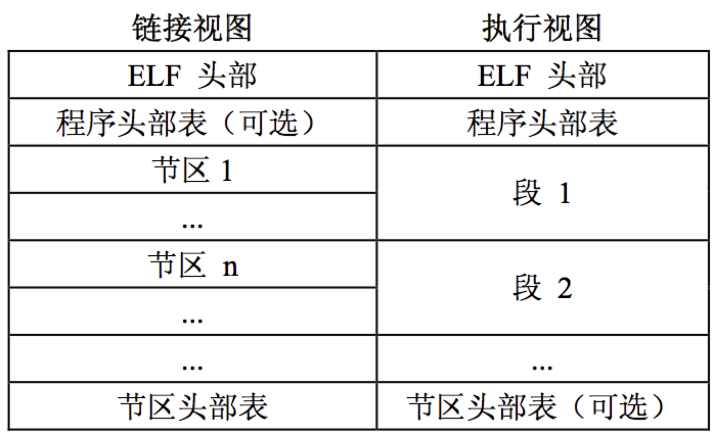

# ELF file format entry

**The content of this document does not need to be memorized, you can understand the relevant concepts, and you can refer to it when analyzing the code.**
## Introduction

Executable and Linking Format (Executable and Linking Format) was originally developed and released by UNIX System Laboratories (USL) as part of the Application Binary Interface (ABI). The Tool Interface Standards (TIS) committee selected the ELF standard, which is also under development, as a portable target file format that can be used in many operating systems on the 32-bit Intel architecture.

There are three types of object files:

Relocatable File (Relocatable File) contains code and data suitable for linking with other target files to create executable files or share target files, corresponding to .obj files for Windows platforms and .o files for Linux platforms.

The executable file (Executable File) contains the information needed by the program to create a process image. Corresponding to the exe file of windows and the dynamic/static compiler of the Lihux platform.

Shared Object File contains code and data that can be linked in two contexts. First, the link editor can process it together with other relocatable files and shared object files to generate another object file. Second, the Dynamic Linker may combine it with an executable file and other shared targets to create a process image. Corresponding to the windows platform. dll files and .so files for Linux platforms.

The object files are all binary representations of the program, and the purpose is to execute directly on a certain processor.

## ELF file format

The target file must participate in both program linking and program execution, and must have a good architectural design.
In order to improve program safety and execution efficiency, the target program is usually divided into multiple sections, such as the common .text section, .data section, .rodata section, .bss section, etc.

The segmented design procedure has the following benefits:

-Prevent the program instructions from being rewritten. After the program is loaded, the data and instructions are mapped to two virtual memory areas, the data area is readable and writable for the process, and the instruction area is read-only, so the permissions can be set to read-write and read-only.
-Contributes to the CPU's cache hit rate. Modern CPU caches are generally designed to separate data cache and instruction cache.
-Sharing instructions. When the system runs multiple copies of the program, it saves a lot of space and copies when writing.


The target file must participate in both program linking and program execution. For convenience and efficiency, the object file format provides two parallel views, each reflecting the different needs of these activities.

Official text:




Chinese translation:


The beginning of the file is an ELF Header (ELF Header), used to describe the organization of the entire file. The section area contains a lot of information of the link view: instructions, data, symbol table, relocation information and so on.

The Program Header Table, if it exists, tells the system how to create a process image. The target file used to construct the process image must have a program header table, which is not required for relocatable files.

The Section Heade Table contains information describing the section area of ​​the file. Each section has an entry in the table, and each item gives information such as the section name and section size. The object file used for linking must contain the section header table. Other object files may or may not have this table.

Note:

-Although the various components shown in the figure are in order, in fact, except for the ELF header table, there is no prescribed order for other sections and segments

-I usually refer to section as a section and program header as a segment (segment). Elf execution does not require a section header table but a program header table is required. I try to set all section headers to 0, and the program can still be executed

-elf link does not need program header table, but must have section header table, because there is no program header table in the relocatable file, but there is section header table, and if a dynamic library so file is set to 0 for all section header table, The link is also unsuccessful, because the symbol search in the linking process depends on the section' search.

This is why the program header table in the link view is optional (optional), and the section header table in the execution view is optional (optional).
## Data types in ELF

Why elf files define their own data types: This is because this file format supports 8-bit to 32-bit processors (now with 64-bit), and elf files use their own defined data types to facilitate compatibility with these various platforms.

```
/* Type for a 16-bit quantity. */
typedef uint16_t Elf32_Half;
typedef uint16_t Elf64_Half;

/* Types for signed and unsigned 32-bit quantities. */
typedef uint32_t Elf32_Word;
typedef int32_t Elf32_Sword;
typedef uint32_t Elf64_Word;
typedef int32_t Elf64_Sword;

/* Types for signed and unsigned 64-bit quantities. */
typedef uint64_t Elf32_Xword;
typedef int64_t Elf32_Sxword;
typedef uint64_t Elf64_Xword;
typedef int64_t Elf64_Sxword;

/* Type of addresses. */
typedef uint32_t Elf32_Addr;
typedef uint64_t Elf64_Addr;
```

These data types can be found in /usr/include/elf.h in the Linux system

## ELF Hearder section

The first few bytes of the file give hints on how to interpret the file. This information is independent of the processor, and
Independent of the rest of the file. The ELF Header part can be represented by the following data structure:

```
/* ELF Header */
typedef struct elfhdr {
unsigned char e_ident[EI_NIDENT]; /* ELF Identification */
Elf32_Half e_type; /* object file type */
Elf32_Half e_machine; /* machine */
Elf32_Word e_version; /* object file version */
Elf32_Addr e_entry; /* virtual entry point */
Elf32_Off e_phoff; /* program header table offset */
Elf32_Off e_shoff; /* section header table offset */
Elf32_Word e_flags; /* processor-specific flags */
Elf32_Half e_ehsize; /* ELF header size */
Elf32_Half e_phentsize; /* program header entry size */
Elf32_Half e_phnum; /* number of program header entries */
Elf32_Half e_shentsize; /* section header entry size */
Elf32_Half e_shnum; /* number of section header entries */
Elf32_Half e_shstrndx; /* section header table's "section
header string table" entry offset */
} Elf32_Ehdr;
typedef struct {
unsigned char e_ident[EI_NIDENT]; /* Id bytes */
Elf64_Quarter e_type; /* file type */
Elf64_Quarter e_machine; /* machine type */
Elf64_Half e_version; /* version number */
Elf64_Addr e_entry; /* entry point */
Elf64_Off e_phoff; /* Program hdr offset */
Elf64_Off e_shoff; /* Section hdr offset */
Elf64_Half e_flags; /* Processor flags */
Elf64_Quarter e_ehsize; /* sizeof ehdr */
Elf64_Quarter e_phentsize; /* Program header entry size */
Elf64_Quarter e_phnum; /* Number of program headers */
Elf64_Quarter e_shentsize; /* Section header entry size */
Elf64_Quarter e_shnum; /* Number of section headers */
Elf64_Quarter e_shstrndx; /* String table index */
} Elf64_Ehdr;
```
-e_ident: introduced as Magic number and other info, a total of 16 bytes.
    -Magic number is the first 4 bytes of the file 0x7F,'E','L','F', used to determine whether it is an ELF file can directly convert the file buffer pointer to unsigned and macro definition #define ELFMAG "\177ELF" to determine whether they are equal.

    -#define EI_CLASS 4 /* File class byte index /, it can be seen from the macro definition that the 5th byte is ei_class, as can be seen from the macro definition behind, this field is used to identify the file type, there are ELFCLASS32 and ELFCLASS64 stands for 32-bit files and 64-bit files.

    -#define EI_DATA 5 /* Data encoding byte index */, the 6th byte is used to encode the format, according to this byte can be judged big endian or little endian.
    -#define EI_VERSION 6 /* File version byte index /, / Value must be EV_CURRENT */, the 7th byte... It says EV_CURRENT must be EV_CURRENT. . .

    -#define EI_OSABI 7 /* OS ABI identification */, the 8th byte, this. . . After reading the definition of the macro, it seems to be used to mark the system platform, including FREEBSD, LINUX, NETBSD, FREEBSD, ARM, etc.

    -#define EI_ABIVERSION 8 /* ABI version */, the 9th byte, introduces the version of ABI, it seems to be all 0, not seen on x86, x64 is not 0, other platforms see

    -#define EI_PAD 9 /* Byte index of padding bytes */, here it is gone, there are 7 bytes left, should be used for padding (padding)

-e_type: used to specify the file type, there are mainly three types of ET_REL, ET_EXEC, ET_DYN, other types have not seen on PC
-e_machine: describe the architecture supported by this elf file, usually EM_386 and EM_X86_64 on PC
-e_version: There is a version related, currently there is only one EV_CURRENT in elf.h.
-e_entry: The virtual address of the program entry point, which is OEP. (It should be noted here that when the e_type of the elf file is ET_EXEC, the e_entry here stores the virtual address VA, if -e_type is ET_DYN (not only the dynamic library, the executable file will also be ET_DYN, that is, the random base is turned on The executable program at the address), then the RVA is stored here, and the imagebase is added after loading into the memory)
-e_phoff: position of the program header table in the file (file offset).
-e_shoff: position of section header table in the file (file offset)
-e_flags: This member holds the processor-specific flags associated with the file. The flag name is in the form of EF_machine_flag. For the definition of flags, please refer to "Machine Information". (Official introduction). all encountered on intel are 0
-e_ehsize: the size of the elf header
-e_phentsize: the size of each entry in the program header table
-e_phnum: number of program header table entries
-e_shentsize: the size of each entry in the section header table
-e_shnum: the number of section header table entries
-e_shstrndx: Section header string table index, which represents the index of the section of the string table in the section header table (note: this string table stores the string table of each scetion name, as well as other string tables)

The header form of an actual executable file is as follows:
```
$greadelf -h hello.so
ELF header:
  Magic: 7f 45 4c 46 01 01 01 00 00 00 00 00 00 00 00 00
  Category: ELF32
  Data: 2's complement, little endian
  Version: 1 (current)
  OS/ABI: UNIX-System V
  ABI version: 0
  Type: DYN (Share Target File)
  System architecture: ARM
  Version: 0x1
  Entry point address: 0x0
  Program header starting point: 52 (bytes into file)
  Start of section headers: 61816 (bytes into file)
  Logo: 0x5000000, Version5 EABI
  Header size: 52 (bytes)
  Program header size: 32 (bytes)
  Number of program headers: 9
  Section header size: 40 (bytes)
  Number of section headers: 24
  String table index section header: 23
```
## Program Header

The header of the program segment table of an executable file or shared object file is an array of structures. Each structure describes a segment or other information necessary for the system to prepare for program execution. The "segment" of the target file contains one or more "segment areas", that is, "segment contents". The program header is only meaningful for executable files and shared object files.

The executable object file gives the size of its own program header in the e_phentsize and e_phnum members of the ELF header. The data structure of the program header:

```
/* Program Header */
typedef struct {
Elf32_Word p_type; /* segment type */
Elf32_Off p_offset; /* segment offset */
Elf32_Addr p_vaddr; /* virtual address of segment */
Elf32_Addr p_paddr; /* physical address-ignored? */
Elf32_Word p_filesz; /* number of bytes in file for seg. */
Elf32_Word p_memsz; /* number of bytes in mem. for seg. */
Elf32_Word p_flags; /* flags */
Elf32_Word p_align; /* memory alignment */
} Elf32_Phdr;
typedef struct {
Elf64_Half p_type; /* entry type */
Elf64_Half p_flags; /* flags */
Elf64_Off p_offset; /* offset */
Elf64_Addr p_vaddr; /* virtual address */
Elf64_Addr p_paddr; /* physical address */
Elf64_Xword p_filesz; /* file size */
Elf64_Xword p_memsz; /* memory size */
Elf64_Xword p_align; /* memory & file alignment */
} Elf64_Phdr;
```
-p_type The type of segment described by this array element, or information on how to interpret this array element. The details are as follows.
    -PT_LOAD: An executable file has at least one PT_LOAD type segment. This type of program header describes a loadable segment, that is, this type of segment will be loaded or mapped into
    -PT_DYNAMIC: The dynamic section is unique to the dynamic link executable file and contains some information necessary for the dynamic linker
    -PT_PHDR: The PT_HDR section saves the position and size of the program header table itself. Phdr table saves all Phdr description information in the middle of the file (and memory mirror)
-p_offset This member gives the offset from the beginning of the file to the first byte of the segment
-Virtual address loaded into memory by p_vaddr
-Physical address loaded into memory by p_paddr
-p_filesz size/bytes of segments in the file image. Can be 0
-p_memsz size/bytes of segments in the memory image. Can be 0
-p_flags This member gives permission flags to change paragraphs.
    -#define PF_R 0x4 //readable
    -#define PF_W 0x2 //Writable
    -#define PF_X 0x1 //executable
-p_align segment alignment

## Program section header

The section contains all the information in the target file, and sections with the same attributes will be combined to form a segment. In the ELF header, the e_shoff member gives the number of offset bytes from the file header to the section header table; e_shnum gives the number of entries in the table; e_shentsize gives the number of bytes per item. From this information, you can accurately locate the specific location and length of the node area.

The data structure description of each section header:

```
/* Section Header */
typedef struct {
Elf32_Word sh_name; /* name-index into section header
string table section */
Elf32_Word sh_type; /* type */
Elf32_Word sh_flags; /* flags */
Elf32_Addr sh_addr; /* address */
Elf32_Off sh_offset; /* file offset */
Elf32_Word sh_size; /* section size */
Elf32_Word sh_link; /* section header table index link */
Elf32_Word sh_info; /* extra information */
Elf32_Word sh_addralign; /* address alignment */
Elf32_Word sh_entsize; /* section entry size */
} Elf32_Shdr;
typedef struct {
Elf64_Half sh_name; /* section name */
Elf64_Half sh_type; /* section type */
Elf64_Xword sh_flags; /* section flags */
Elf64_Addr sh_addr; /* virtual address */
Elf64_Off sh_offset; /* file offset */
Elf64_Xword sh_size; /* section size */
Elf64_Half sh_link; /* link to another */
Elf64_Half sh_info; /* misc info */
Elf64_Xword sh_addralign; /* memory alignment */
Elf64_Xword sh_entsize; /* table entry size */
} Elf64_Shdr;
```

-sh_name: This field determines the name of the section. Its value is not a string, but the index of the section name string table.

-sh_type: type of section
    -SHT_SYMTAB: symbol table
    -SHT_STRTAB: string table
    -SHT_DYNAMIC: dynamic link information
    -SHT_REAL: relocation table
-sh_flags: support one-bit flags to describe various attributes
    -SHF_WRITE: The section area contains data that will be writable during process execution.
    -SHF_ALLOC: This section takes up memory during process execution. Some control nodes do not appear in the target
    In the memory image of the file, for those sections, this bit should be set to 0.
    -SHF_EXECINSTR: The section contains executable machine instructions.
    -SHF_MASKPROC: All four bits contained in this mask are used for processor-specific semantics.

sh_addr: The virtual address where the section area is loaded.

sh_offset: The offset of the section area in the file.

sh_size: The number of bytes in the section.

sh_link: This member holds an index link to the section header table, and its interpreter decides according to the type of section.


sh_addralign: alignment limit.

sh_entsize: Some sections hold/save a table of fixed-size items, such as a symbol table. For such a section, this member gives the size in bytes of each item.