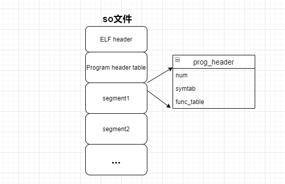

# Shared library design principles
### Analysis of files related to shared libraries
The dynamic library is compiled from the dll_lib.c file and lib-support.h, first look at the dll_lib.c file:
```
1: #include "lib-support.h"
2:  
3: int add_func(int a, int b)
4: {
5: return (a + b);
6:}
7:
8: int dec_func(int a, int b)
9:  {
10: return (a-b);
11:}
12:
13: void *func_table[] = {
14: add_func, dec_func
15: };
16:
17: char *symtab[] = {
18: "add_func","dec_func"
19:}
20:
21: MDL_DEFINE_HEADER(func_table, symtab, sizeof(func_table)/sizeof(func_table[0]));
```
1. Lines 3 and 8 define two functions in this file:
    -add_func is an addition function to complete the addition function
    -dec_func is a subtraction function, complete the subtraction function

2. Lines 13 and 17, after defining the function to be used, fill the function pointer into the func_table function table, and fill the name of the function into the sysmtab character table.
    -func_table function table: in the future we will call the functions we need to use from this table
    -sysmtab character table: in the future we will look up the functions we need to use from this table

3. Next, the MDL_DEFINE_HEADER macro is used at line 21, the macro prototype is located in the lib-support.h file,
As follows:

```
    1: #define MDL_DEFINE_HEADER(user_info_value,user_info_symtab,size); \
    2: struct program_header PROG_HEADER = {\
    3: .num = size, \
    4: .symtab = user_info_symtab, \
    5: .user_info = user_info_value, \
    6: };
```
### MDL_DEFINE_HEADER Macro Analysis
1. Line 1, this macro is used to define and initialize a variable PROG_HEADER of type struct program_header,
The initialization values ​​are the function table size, sysmtab character table, and func_table function table.
2. Line 2, PROG_HEADER is actually a macro definition, defined in the Makefile, as shown below:
```
...
    1: CFLAGS = -std=gnu99 -Wall -Werror -g -D_GNU_SOURCE
    2: CFLAGS += -DPROG_HEADER=prog_header
    3: TARGET = loader
    ...
```
3. CFLAGS is the dynamic library compilation option, through the -D option, specify a macro, after the equal sign is the value of the macro,
Equivalent to #define PROG_HEADER prog_header.

4. From the above analysis, we can see that after program preprocessing, struct program_header PROG_HEADER is replaced by
struct program_header prog_header.

5. When compiling and generating a dynamic library, specify prog_header as the program entry in the Makefile, as shown below:

```
...
1: $(OUT)/dll_lib.so: $(OUT)/dll_lib.o
2: $(CC) -shared -Wl,--entry=prog_header -Wl,-z,defs -nostdlib \
3: $< -o $@
...
```
6. In the final generated .so link library, the prog_header variable will be used as the entry point of the program, and will be compiled and linked at the beginning of the code segment.

7. Finally, in the elf file format of the .so program, the start of the first executable section is loaded with the funct_tab function table, symtab symbol table, etc. (in the future, after our application loads the shared library, it will start from this Get the corresponding information in the table). As shown below:

