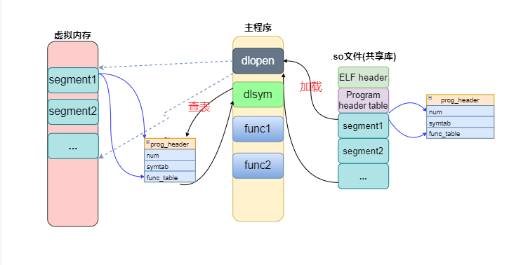
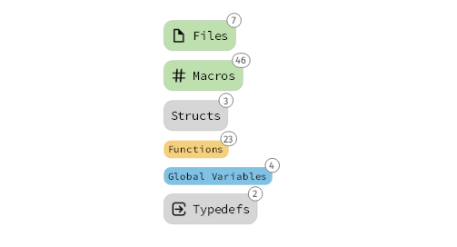
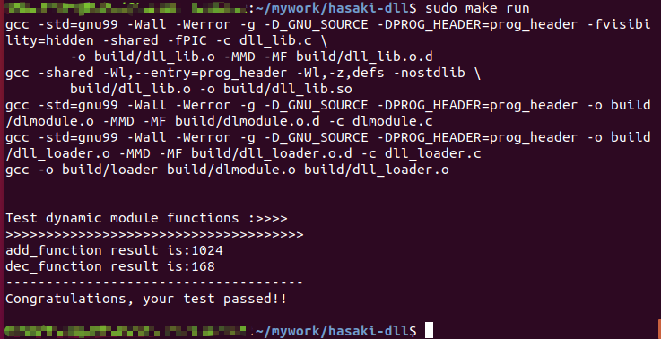

[中文说明](./doc/Ch_REMEAD.md)

# Implementation of dynamic module loader

A safe and concise dynamic module loader under the Linux platform. Its code implementation is simple and elegant. It is very suitable for small partners who want to explore the underlying mechanism of the program and deepen their understanding of the dynamic linker.

## "hasaki-dll" Architecture Design

The design is divided into three parts:

1. Dynamic module loader (main program)
2. Dynamic shared library file (.so)
    -Automatically compatible with ELF files of different architectures
    -Customize the library file format
3. Function table/symbol table structure (prog_header)

As shown below:



It has the following advantages:

- upports the POSIX standard **libdl API**, similar to using the **dlopen function** to load a dynamic library into memory (and parse some of the symbol information), by this dynamic library (via the **dlsym function **) Provide corresponding function operation set

- Abandon the obscure and complicated mechanism of the dynamic linker under Gnu/Linux system, and re-implement it in an intuitive, concise and elegant way

- ompatible with X86-64/ARM platform, no need to modify any configuration file, just use gcc compiler or cross compiler to compile

- Provide detailed program documentation, just put in a little patience, hardly worry about not reading



## How to run code tests
Please make sure you have installed gcc/arm-gcc

**Test procedure:**
```
1. Get the project code
    git clone XXX
2. Enter the project folder
    cd hasaki-dll
3. One-click compile and run
    -x86-64 platform: make run
    -ARM platform: make all CROSS_COMPILE=gcc-arm-linux-gnueabihf
    You can also manually compile and run
    make
    cd build
    ./loader dll_lib.so
```

If all goes well, you will get the following execution result:




This is the first version code of this project and the most suitable version code for getting started to understand the dynamic connector.
The functions of the following dynamic connectors will be iterated successively according to the actual situation:

- Late binding (PLT)

- Dynamic linker bootstrapping

- Global symbol intervention for shared objects


The following is the relevant document for the knowledge compiled for the project. If you have not studied the ELF file format before, please read it from the beginning:

(1). [Introduction to ELF file format](./en_doc/ELF_file_format_intro.md)

(2). [Principles of Shared Library Design](./en_doc/Principles_of_Shared_Library_Design.md)

(3). [Principle of dynamically loading shared libraries](./en_doc/loading_shared_libraries.md)

(4). [Test program analysis](./en_doc/test_program_analysis.md)


**Note:** The platform architecture assembly code in the arch directory is mainly prepared for adding PLT (delayed loading) for the next version. Now you can ignore them.
