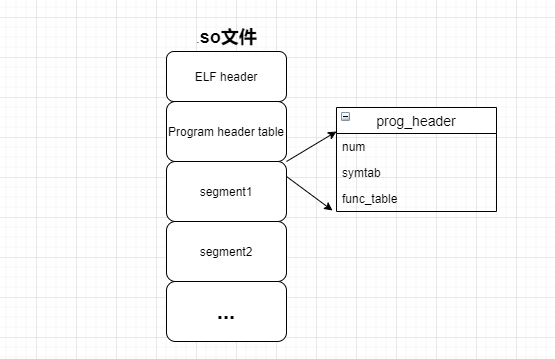

# 共享库设计原理
### 共享库相关文件分析
动态库是由dll_lib.c文件和lib-support.h编译而成,先看dll_lib.c文件:
```
1:  #include "lib-support.h"
2:  
3:  int add_func(int a, int b)
4:  {
5:      return (a + b);
6:  }
7:  
8:  int dec_func(int a, int b)
9:  {
10:      return (a - b);
11:  }
12:  
13:  void *func_table[] = {
14:      add_func, dec_func
15:  };
16:  
17:  char *symtab[] = {
18:      "add_func","dec_func"
19:  }
20:  
21:  MDL_DEFINE_HEADER(func_table,symtab,sizeof(func_table)/sizeof(func_table[0]));
```
1. 第3、8行分别在该文件中定义了两个函数：
    - add_func为加法函数，完成加法功能
    - dec_func为减法函数，完成减法功能

2. 第13、17行，定义好要使用函数之后，把函数指针填充到func_table函数表中，把函数的名字名字填充到sysmtab字符表中。
    - func_table函数表:将来我们会从这个表中调用需要使用的函数
    - sysmtab字符表：将来我们会从这个表查找需要使用的函数

3. 接下来，在21行处使用了MDL_DEFINE_HEADER宏，这个宏原型位于lib-support.h文件中，
如下所示:

```
    1:  #define MDL_DEFINE_HEADER(user_info_value,user_info_symtab,size); \
    2:  struct program_header PROG_HEADER = {                 \
    3:      .num = size,                                      \
    4:      .symtab = user_info_symtab,                       \
    5:      .user_info = user_info_value,  		      	      \
    6:  };
```
### MDL_DEFINE_HEADER宏分析
1. 第1行，这个宏用来定义并初始化一个struct program_header类型的变量PROG_HEADER，
初始化值为函数表大小、sysmtab字符表、func_table函数表。
2. 第2行，PROG_HEADER其实是一个宏定义，在Makefile文件里面定义的，如下图:
```
...
    1:  CFLAGS = -std=gnu99 -Wall -Werror -g -D_GNU_SOURCE
    2:  CFLAGS += -DPROG_HEADER=prog_header
    3:  TARGET = loader
    ...
```
3. CFLAGS为动态库编译选项，通过-D选项，指定一个宏，等号后面为宏的值，
相当于#define PROG_HEADER prog_header。

4. 从上面分析可知，程序预处理后，struct program_header PROG_HEADER被替换为
struct program_header prog_header。

5. 当编译生成动态库时，在Makefile文件中指定prog_header为程序入口，如下图:

```
...
1:      $(OUT)/dll_lib.so: $(OUT)/dll_lib.o
2:          $(CC) -shared -Wl,--entry=prog_header -Wl,-z,defs -nostdlib \
3:              $< -o $@
...
```
6. 在最终生成的.so链接库中，prog_header变量将作为程序的入口，被编译链接在代码段的起始位置中。

7.最终,在.so程序的elf文件格式中，第一个可执行段的起始位置就装载了funct_tab函数表、symtab符号表等（将来，我们的应用程序加载共享库后，会从这个表中获取相应信息)。如下图所示:

