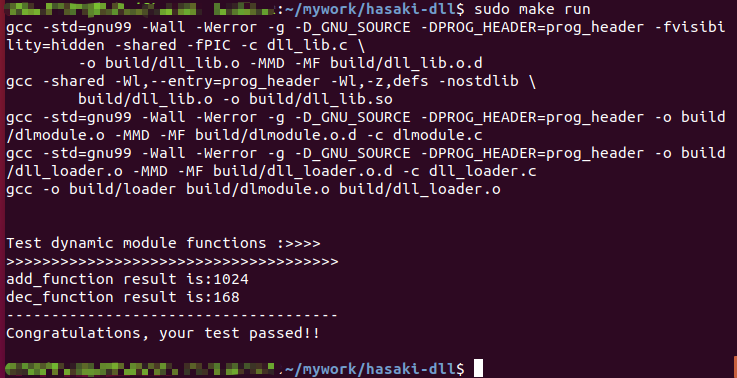

## 动态模块加载器的实现

Linux平台下的一个安全、简洁的动态模块加载器，其代码实现简洁优雅，非常适合想要探索程序底层机制和加深了解动态链接器的小伙伴。

它具有以下优点:

- 支持POSIX 标准的 libdl API,类似于把一个动态库加载到内存中（并解析其中的一些符号信息），
由这份动态库提供对应的函数操作集

- 放弃Gnu/Linux系统下动态连接器的晦涩复杂机制，重新以一种直观、简洁、优雅的方式实现

- 兼容X86-64、ARM平台，无需修改任何配置文件，直接使用gcc编译器或者交叉编译器编译即可

- 提供详细的程序说明文档，只需投入一点耐心，不用担心看不懂


## 如何运行代码测试
请确保你的已经安装了gcc/arm-gcc

**测试步骤：**
```
1、获取项目代码
    git clone XXX
2、进入项目文件夹
    cd hasaki-dll
3、一键编译并执行
    -  x86-64平台：make run
    -  ARM平台：make all CROSS_COMPILE=gcc-arm-linux-gnueabihf
```
如果一切顺利，你会得到以下执行结果:




这是本项目的第一版代码，也是最适合入门了解动态连接器的版本代码。
后续会根据实际情况陆续迭代以下动态连接器的功能：

- 动态链接器自举

- 共享对象全局符号介入

- 延迟绑定（PLT）

下面为本项目相关的知识文章，若此前没有研究过ELF文件格式，请从头开始阅读:

(一)入门ELF文件格式

(二)动态模块加载器程序分析
